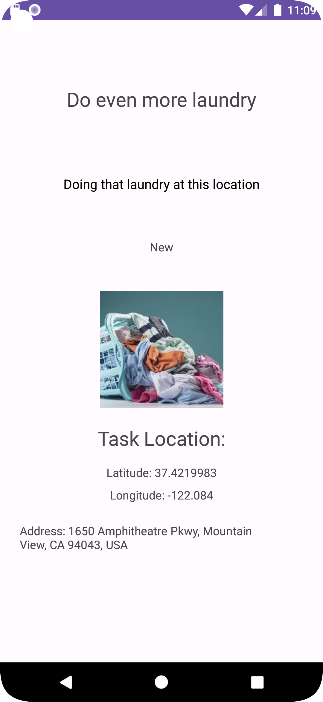

# TaskMaster Lab Series Main Readme/TOC

* [Lab 26: Taskmaster Initial](#class-26-taskmaster-initial)
* [Lab 27: Adding Data](#class-27-adding-data-lab)
* [Lab 28: RecyclerViews](#class-28-recyclerviews)
* [Lab 29: Room](#class-29-room)
* [Lab 31: Espresso Tests](#class-31-testing-views-with-espresso)
* [Lab 32: Amplify AWS](#class-32--amplify-aws)
* [Lab 33: Another Day, Another Model](#class-33-another-day-another-model)
* [Lab 34: Polish and Publish TaskMaster](#class-34-polish-and-publish-taskmaster)
* [Lab 36: Cognito](#class-36-cognito)
* [Lab 37: S3 Image Uploads](#class-37-s3-image-uploads)
* [lab 39: Location](#class-39-location)

___

### Directory of individual lab Readme files: [readme-catalog](/readme-catalog/)

* [Lab 26: Taskmaster Initial](/readme-catalog/lab26.md)
* [Lab 27: Adding Data](/readme-catalog/lab27.md)
* [Lab 28: RecyclerViews](/readme-catalog/lab28.md)
* [Lab 29: Room](/readme-catalog/lab29.md)
* [Lab 31: Espresso Tests](/readme-catalog/lab31.md)
* [Lab 32: Amplify AWS](/readme-catalog/lab32.md)
* [Lab 33: Another Day, Another Model](/readme-catalog/lab33.md)
* [Lab 34: Polish and Publish TaskMaster](/readme-catalog/lab34.md)
* [Lab 36: Cognito](/readme-catalog/lab36.md)
* [Lab 37: S3 Image Uploads](/readme-catalog/lab37.md)
* [lab 39: Location](/readme-catalog/lab39.md)

___

## Description

This is an application which will evolve over time as a "To Do List" program that uses different 
data storage and hosting methods and adds components and functionality over time.

## Instructions
___
### *API 26 is required once Amplify Functions are implemented*
___

***Lab 37: S3 Image Uploads***

Keep in mind the following
1. Amplify IAM User are usernames for Developers
2. Cognito/Auth User Pools are usernames for end users
3. DynamoDB is a NoSQL database that stores schema/model related data
4. S3 is a file storage service for large amounts of data (images in our uses)

*When using an emulator be sure to put images in your emulator that can be uploaded for testing*

    In order to run the application, you must run it through an Android Emulator. 
    It was constructed using a Pixel 5 emulator with a minimum android API 26 and target of 33.

    

***Lab 32 & up: Amplify AWS and Dates***
In order to operate the application one must use an Android Emulator with a minimum of 26 for features to work properly.


***Lab 31: Espresso Tests Additional Instructions:***
To run tests (and view them running), run emulator within Android Studio. All Test `.java` files are located: `app/src/androidTest/java/com/navelfuzz/taskmaster/*` 

Or

Use the `.gradlew/*` CLI command
___ 

## Change Log
Screenshots for current lab always at bottom of this page

### Class 39: Location
Added Location services, Task Detail activity now shows location of task if it exists.


### Class 37: S3 Image Uploads
Implemented S3 Storage in order to upload images associated with user tasks.

The buildout requires passes a key from the S3 bucket to the Task object in order to display the image on the Task Detail page.

General Lab Steps:
    1. Added S3 dependencies to `build.gradle`
    2. Ran `amplify add storage` and `amplify push` to add S3 to Amplify
    3. Added S3 code to `MainActivity.java` to upload images to S3
        a. hardcoded the functionality step by step in order to understand the process
    4. Added S3 code to app components and built out layout/flow
    5. Updated schema.graphql to include S3 key
        a. Then ran `amplify codegen models` to update models


### Class 36: Cognito
Added Cognito for Auth to application.
    1. Created Login Page
    2. Created SignUp Page
    3. Created Verification Page

### Class 34: Polish and Publish TaskMaster
1. Created `app-release.aab` file withing `app/build/outputs/bundle/release` directory
2. Created Google Play Store account
3. Created Google Play Store listing for TaskMaster
4. Uploaded `app-release.aab` file to Google Play Store
5. Awaiting Identity confirmation (01OCT) to Publish TaskMaster to Google Play Store
6. Named app `TaskMaster Basic` for Google Play Store

### Class 33: Another Day, Another Model

1. Tasks Are Owned By Teams
   * Create a second entity for a team, which has a name and a list of tasks. Update your tasks to be owned by a team. 
   * Manually create three teams by running a mutation exactly three times in your code. (You do NOT need to allow the user to create new teams.)
2. Add Task Form
   * Modify your Add Task form to include either a Spinner or Radio Buttons for which team that task belongs to.
3. Settings Page
   * In addition to a username, allow the user to choose their team on the Settings page. Use that Team to display only that team’s tasks on the homepage.

### Class 32: Amplify AWS

#### Branch `lab32a`: Deletion of Room and preparations for AWS implementation.
 
1. Followed steps for adding Amplify API to application
   * Created Amplify AWS account and IAM User
   * Ran the following Amplify CLI commands:
     * `amplify configure`
       * Added Amplify Gradle dependencies to /app `build.gradle` 
     * `amplify init`
     * `amplify add api`
       * `amplify api update`: to verify error detection: off
     * `amplify push`
   * Ran `amplify codegen models` to generate models from GraphQL schema
2. Created `TaskMasterAmplifyApplication.java` to configure Amplify
3. Modified `AddTaskActivity.java` to add tasks to DynamoDB
4. Modified `MainActivity.java` to display tasks from DynamoDB
    * Also modified `ViewAdapter.java` to display tasks from DynamoDB
    * Also modified `TaskListFragment.java` to display tasks from DynamoDB
5. Modified `Task.java` to be a model for DynamoDB
    * As well as `TaskStatusEnum.java` and other Amplify generated files via schema development.

#### Branch `lab32b`: Setup Amplify for application which utilizes GraphQL API, DynamoDB.

1. Deleted Room's Gradle dependencies
2. Deleted Database Class
3. Deleted Dao class
4. Removed @Entity & @PrimaryKey annotations
5. Deleted database variables
6. Commented out dao usages

### Class 31: Testing Views with Espresso

1. Espresso Testing
   * Add more Espresso UI tests to your application, if you haven’t already. Make sure you do at least these three tests:
     * assert that important UI elements are displayed on the page
     * tap on a task, and assert that the resulting activity displays the name of that task
     * edit the user’s username, and assert that it says the correct thing on the homepage

   ***Special Note:***
   * I had to add the following to the build.gradle file in order to get the tests to run:
    ```    
    implementation "androidx.tracing:tracing:1.1.0"
    ```
   * Additionally in my MainAcivityTest2 I had to adjust the 105 line and comment out the `pressBack();` in order to stop the 
   test from closing the application and failing. I am not sure why this is happening, but I will look into it further.

    #### Test Purposes
   1. UserNameTest - Tests that the username is displayed on the homepage
   2. MainActivityTest - Tests that both MainActivity buttons navigate to their corresponding pages
   3. MainActivityTest2 - Tests that adding a task and clicking on that task in the RecyclerView navigates to that task's details page

2. Built APK
   * Did not do this for the Class 27 lab but did for this one as said in the Lab 27 lecture it would be required for this weeks labs for points.

### Class 29: Room 

1. Task Model and Room
   * Following the directions provided in the Android documentation, set up Room in your application, and modify your Task class to be an Entity.
2. Add Task Form
   * Modify your Add Task form to save the data entered in as a Task in your local database.
3. Homepage
   * Refactor your homepage’s RecyclerView to display all Task entities in your database.
4. Detail Page
   * Ensure that the description and status of a tapped task are also displayed on the detail page, in addition to the title. (Note that you can accomplish this by passing along the entire Task entity, or by passing along only its ID in the intent.)

### Class 28: RecyclerViews

1. Task Model
   * Create a Task class. A task should have:
        * Title
        * Body
        * State (new, assigned, in progress, complete)
2. Homepage
   * Refactor the homepage to use a RecyclerView for displaying Task data (hardcoded task data for now)
   * Some Steps
     * Create a ViewAdapter class that displays data from a list of Tasks.
     * In your MainActivity, create at least three hardcoded Task instances and use those to populate your RecyclerView/ViewAdapter.
   * Ensure that you can tap on any one of the Tasks in the RecyclerView and it will appropriately launch the detail page with the correct Task title displayed.


### Class 27: Adding Data Lab
1. Task Details Page
   * Show the selected task's title
   * Lorem Ipsum that description
2. Settings Page
   * Input field for Username
   * save button to save the Username
3. Homepage
   * Add Username Label which starts as empty
   * Navigate to the Settings Page via button ***if the user saves their username, display it when we come back to the homepage***
   * Add 3 buttons with "task" titles (hardcoded task titles)
      * Navigate to Task Details Page send the task title
         * Title at top of page should match task selected


### Class: 26 TaskMaster Initial
1. Homepage
    * Title
    * Placeholder Img
    * Button::nav to All Tasks Page
    * Button::nav to Add Task Page
2. Add Task Page
   * Title
   * Input field for task name
   * Input field for task description
   * Add task button
   * "Submitted" indicator
   * Total Tasks label (non functional just present)
3. All Tasks Page
   * No Functionality
   * (Optional) Placeholder Img
   
**All these requirements were implemented**

[//]: # (## Links/Notes/Info)
[//]: # (Generic img link for these readmes)
[//]: # ()


## Screenshots for Lab: Class 39



[//]: # ()

[//]: # ()

