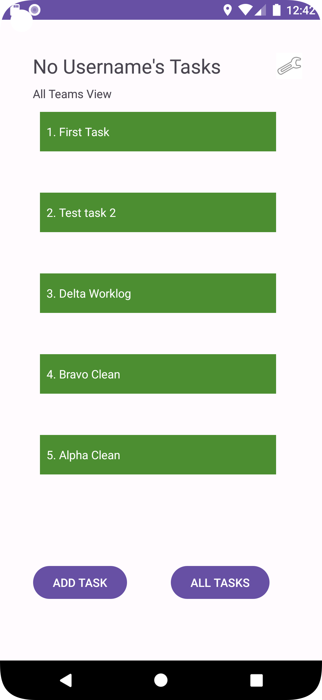

# Lab 36: Adding Cognito

## Overview
Today, your app will allow users to sign up and log in using Cognito.

### Setup
Continue working in your taskmaster repository.

## Resources
[Amplify and Cognito](https://aws-amplify.github.io/docs/android/authentication)

## Feature Tasks

### User Login
Add Cognito to your Amplify setup. Add in user login and sign up flows to your application, using Cognito’s pre-built UI as appropriate. Display the logged-in user’s username (or nickname) somewhere relevant in your app.

### User Logout
Allow users to log out of your application.

### Documentation
Update your daily change log with today’s changes.

### Screenshots

 
 
 
 
 
 

